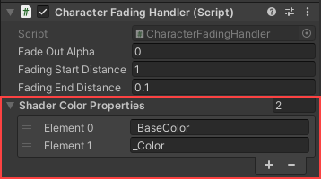

# Other render pipelines or custom shaders

This asset is written based on URP. However, other pipelines and custom shaders are also supported. Every camera subcomponent that deals with the fading of objects has a list of shader color properties:

 
Checking from top to bottom, the first property that is found in the shader is treated as the color property. By default, "_BaseColor" is used by Unity’s URP/HDRP shaders and "_Color" is used by BRP shaders. If your own shader uses a deviating property for controlling its color, just add the property name to the list.

