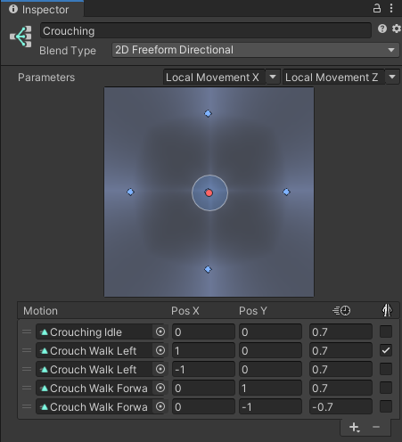
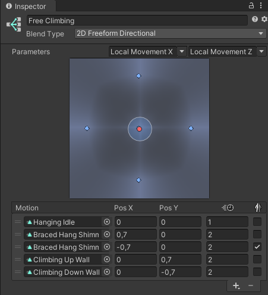
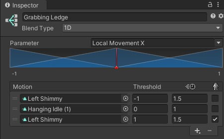

# Scene Setup

In the following, you find the steps for correctly setting up your own scene with my components in it.

## Attaching the scripts

All scripts which are related to the character can be found inside Scripts > Character. Attach the scripts of your choice to your character game object, usually to its root game object:

1. **RPGCamera:** Attach this script if you would like to use my camera controls, i.e. everything which has to do with the behavior of the virtual camera. The required helper component RPGViewFrustum will automatically be attached as well.
1. **RPGController:** Attach this script if you would like to use my character controls, i.e. everything which deals with processing user input and propagating them to a motor. Therefore, having a controller without a motor does not have any effect. You additionally need to add a RPGMotor of your choice: ARPG or MMO.
1. **RPGMotor[ARPG/MMO]:** Choose how the player inputs should be processed, i.e. either in an ARPG or an MMO fashion. Attaching an RPGMotor component will automatically add Unity's Character Controller component if not already present.
2. Open the Player Input component that was automatically added and assign the provided **RPGInputActions** (from Scripts > Inputs) to the Actions property. Optionally set the Behavior to "Invoke C Sharp Events".

## Adding animations

Attach Unity's Animator component to your character game object and assign the animator controller "Character" in folder Animator Controllers.

Now, you can change the animations of the corresponding animation state or animation blend tree depending on your needs. The asset comes with animations from Unity's 3D Game Kit, user Naked Fighter and some from Blink Studio's "FREE - 32 RPG Animations" package. Please check out their great work [here](https://assetstore.unity.com/publishers/49855). Besides that, there are 8 animations from Mixamo in the provided animator I am unfortunately not allowed to ship with my asset. Nevertheless, it is possible to download them for free on their website if you want to use them in your project. Here are the links:

1. [Crouch Idle 01](https://www.mixamo.com/#/?page=1&query=crouch+idle+01&type=Motion%2CMotionPack)
1. [Crouch Walk Forward](https://www.mixamo.com/#/?page=1&query=Crouch+Walk+Forward+&type=Motion%2CMotionPack)* (here the archer animation)
1. [Hanging Idle](https://www.mixamo.com/#/?page=1&query=Hanging+Idle&type=Motion%2CMotionPack)
1. [Braced Hang Shimmy](https://www.mixamo.com/#/?page=1&query=Braced+Hang+Shimmy&type=Motion%2CMotionPack)
1. [Climbing Up Wall](https://www.mixamo.com/#/?page=1&query=Climbing+Up+Wall&type=Motion%2CMotionPack)
1. [Climbing Down Wall](https://www.mixamo.com/#/?page=1&query=Climbing+Down+Wall&type=Motion%2CMotionPack)
1. [Hanging Idle (1)](https://www.mixamo.com/#/?page=1&query=Hanging+Idle&type=Motion%2CMotionPack)
1. [Left Shimmy](https://www.mixamo.com/#/?page=1&query=Left+Shimmy&type=Motion%2CMotionPack)

And here are screenshots how their corresponding blend trees are properly set up in the Character animator:

    
    
    

     
\* Animation "Crouch Walk Left" is just a copy of "Crouch Walk Forward" with 90° Root Transform Rotation offset.

## Assigning the right layer

Make sure that your character game object and all of its children have the "Player" layer assigned. Otherwise, the provided motor scripts might not behave properly. However, if you definitely need to have child objects assigned to other layers, use the provided layer mask "Ignored Layers" of the RPGMotor to rule them out. This way, they are not considered for the grounded check, sliding check, etc. If you pick User Layer 8 to be "Player", asset prefabs automatically get this layer assigned.

For setting up climbing or ledge grabbing, assign a layer of your choice to the climbable collider, e.g. an own "Climbable" layer, and make it one of the **"Climbable Layers"** in the RPGMotor component. If you pick User Layer 9 to be "Climbable", climbable game objects in the demo scenes automatically get this layer assigned.

If you are using one of the RPGCamera scripts, make sure to check the **"Occluding Layers"** variable of the also attached RPGViewFrustum component. Every game object in the scene in/with one of these layers causes the camera to automatically zoom in on occlusion! Refer to the corresponding section [RPG View Frustum](../components/rpg-view-frustum.md) for more information on the implemented logic.

## Moving platforms (optional)

If you want the character to move and rotate with ground objects like platforms, you need to assign the MovingPlatform script to them. Furthermore, a box collider which acts as a trigger is required. The trigger is used for detecting new or left passengers. I recommend checking out the provided "Moving Platform" prefabs which are also used in the demo scenes. As you know, a picture is worth a thousand words.

## Water and swimming (optional)

For leveraging the swimming feature of the RPGMotor, three things have to be considered:

1. You need a water game object which has the "Water" script/component assigned
1. This water game object must have a box collider that acts as a trigger attached
1. The variable "Swimming Start Height" of the RPGMotor controls at which local height the character should start to swim (visualized by a small blue plane when gizmos are enabled)

Check out the prefab "Water" in folder Prefabs for reference. 

## Using the correct shader (optional)

To make the fade out of game objects work, they need to have a material with a Fade/Transparent shader assigned, e.g. Unity's standard shader with render mode "Fade" or one of the provided custom shaders in folder Misc > Shaders. Just check out which shaders are used in the provided demo scenes.