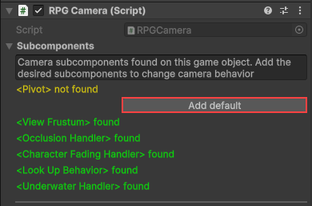

# Scene Setup

It is generally recommended to **just copy and adjust the provided prefabs** instead of setting up everything from scratch. However, if you would like to do this nevertheless - or just want to know more about the individual components - you find more information in the following.

## Attaching the scripts

All scripts which are related to the character can be found inside Scripts > Character. Attach the scripts of your choice to your character game object, usually to its root game object:

1. **[A/Iso/MMO]RPGController:** Choose how the player inputs should be processed by the RPGCamera and RPGMotor, i.e. either in an ARPG, Isometric RPG or an MMORPG fashion. Without this script, the camera and the character will not move.
1. **InputHandler:** Takes care of initializing input actions and providing player input data.
1. **PlayerInput:** This component is automatically added with the InputHandler. Open it and assign the RPGInputActions inside the "Input" folder to the "Actions" property. Optionally, set the Behavior to "Invoke C Sharp Events".
1. **RPGMotor:** Component for moving the caracter. Attaching it will automatically add Unity's Character Controller component if not already present. Additional functionality is based on the subcomponents you add to the game object – either manually or by adding a default via button (see screenshot below).
1. **Animation Handler:** Component for translating method calls into Animator parameters. Therefore, attaching it will automatically add Unity's Animator component if not already present.
1. **RPGCamera:** This script contains all general camera functionality like yaw, pitch or zoom. Additional functionality is based on the subcomponents you add to the game object – either manually or by adding a default via button (see screenshot below).
1. (Optional) **CursorHandler:** This script is used by the RPGController to control cursor behavior. Add it if you need some cursor handling on top of camera functionality, e.g. hiding and letting it stay in place when camera orbiting starts.

  

    
<strong>RPG Camera</strong>

    
  

  

    
<strong>RPG Motor</strong>

    
  

!!! note
    No subcomponent is required for the camera or the motor to work!

!!! info
    Refer to the [Scene Setup](../../rpg-camera/getting-started/scene-setup.md#assigning-the-right-layers) of my [RPG Camera](../../rpg-camera/introduction.md) asset for camera-related step.
     
## Water and swimming (optional)

For leveraging the swimming feature of the RPGMotor, three things have to be considered:

1. You need a water game object which has the "Water" script assigned
1. This water game object must have a rigidbody and a box collider attached that acts as a trigger ("Is Trigger" checked)
1. The variable "Personal Start Level" of the RPGMotor's "Swimming Handler" subcomponent controls at which local height the character should start to swim (visualized by a small blue plane when gizmos are enabled)

Check out the provided prefab "Water" for reference.

## Climbing (optional)

The "Climbing Handler" subcomponent of the RPGMotor offers three functionalities:

1. Free climbing on climbable surfaces
1. Ledge grab and movement along the ledge
1. Pulling up ledges

For tweaking their check variables, e.g. grab height or range, I recommend turning on the corresponding setup gizmos provided by the "Climbing Handler". Hover over a setup variable to get more information about it.

!!! important
    Do not forget to assign a climbable layer of the "Climbable Layers" layer mask to the object which should be climbed.

## Moving platforms (optional)

If you want the character to move and rotate with ground objects, like platforms, you need to 

1. Assign the "Carrier" script to them
1. Add a box collider which acts as a trigger ("Is Trigger" checked). It is required for detecting new or left passengers 

Check out the provided prefab "Moving Platform" which are also used in the demo scene.